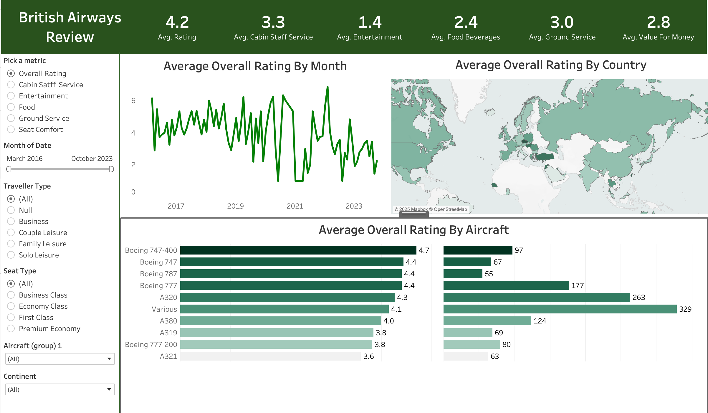

{\rtf1\ansi\ansicpg1252\cocoartf2822
\cocoatextscaling0\cocoaplatform0{\fonttbl\f0\fswiss\fcharset0 Helvetica;}
{\colortbl;\red255\green255\blue255;}
{\*\expandedcolortbl;;}
\paperw11900\paperh16840\margl1440\margr1440\vieww11520\viewh8400\viewkind0
\pard\tx720\tx1440\tx2160\tx2880\tx3600\tx4320\tx5040\tx5760\tx6480\tx7200\tx7920\tx8640\pardirnatural\partightenfactor0

\f0\fs24 \cf0 # \uc0\u9992 \u65039  British Airways Review Dashboard\
\
This Tableau dashboard analyzes customer reviews for British Airways across different aircraft, service categories, and travel types.\
\
 \
\
---\
\
## \uc0\u55357 \u56522  Project Overview\
\
**Objective:**  \
To uncover insights from British Airways customer reviews by analyzing:\
\
- Average ratings across aircrafts and countries\
- Ratings over time\
- Differences by travel class and traveler types\
\
**Key Metrics:**\
- Avg. Overall Rating: 4.2\
- Avg. Cabin Staff Service: 3.3\
- Avg. Entertainment: 1.4\
- Avg. Food & Beverages: 2.4\
- Avg. Seat Comfort: 2.9\
- Avg. Value for Money: 2.8\
\
---\
\
## \uc0\u55357 \u57056 \u65039  Tools Used\
\
- Tableau (Desktop)\
- Data: Airline reviews dataset (2016\'962023)\
\
---\
\
## \uc0\u55357 \u56513  Files Included\
\
| File | Description |\
|------|-------------|\
| `british_airways_reviews.twbx` | Tableau workbook file |\
| `airline_reviews.csv` | Raw dataset |\
| `Screenshot-2025-07-31-BritishAirways.png` | Dashboard image preview |\
| `README.md` | Project overview |\
\
---\
\
## \uc0\u55357 \u56424 \u8205 \u55357 \u56507  Author\
\
**Kartik Bhardwaj**  \
[LinkedIn]() \'95 [Email](#)\
\
---\
\
## \uc0\u55357 \u56599  License\
\
This project is for educational use only.\
}